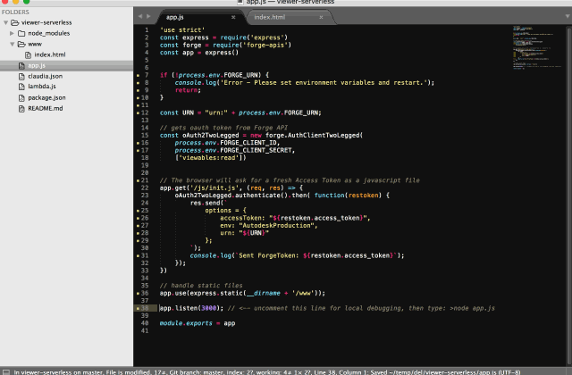

# ForgeViewer-Serverless

**Live Demo**: [https://adc6qwtnce.execute-api.us-east-1.amazonaws.com/tutorial/](https://adc6qwtnce.execute-api.us-east-1.amazonaws.com/tutorial/)

**YouTube**: [demo]()



This is the 'hello world' example of [Autodesk Forge Viewer](https://developer.autodesk.com/en/docs/viewer/v2/overview/) deployed to [AWS-Lambda](aws.amazon.com/Lambda‎)... aka 'Serverless'.


To simplify deploy to AWS-Lambda, I use ['Claudia.js'](https://claudiajs.com/tutorials/serverless-express.html).  The backend stack is [Node.js](https://claudiajs.com/tutorials/serverless-express.html) / [Express](http://expressjs.com/).  

Below I demonstrate ['Claudia.js'](https://claudiajs.com/tutorials/serverless-express.html) 'update' command to re-deploy a small html code change. Claudia handles the task of zipping, uploading and re-wiring node.js endpoints to 'AWS-Lambda & API-Gateway' automatically. 

## Getting Started
Before you start, make sure you have [npm and AWS credentials](https://vincetocco.com/serverless-code/) setup.

1. Run `npm install`
2. Run `npm run create` to send everything up to AWS Lambda. It will return a 'new URL'.
3. Edit the file `package.json` and update the variables `FORGE_CLIENT_ID=xxx,FORGE_CLIENT_SECRET=xxx,FORGE_URN=xxx` with your own Forge values.
4. Run `npm run setvars` to push the environment variables to Lambda.
5. Open the 'new URL' in a browser

**Example:** [https://adc6qwtnce.execute-api.us-east-1.amazonaws.com/tutorial/](https://adc6qwtnce.execute-api.us-east-1.amazonaws.com/tutorial/)

> Remember to add a '/' or a '/index.html' to the URL.

## Updating the app

1. Make a code change to file ```'www/index.html'```
3. Run `npm run update`...
It output a 'new URL'
3. Open the 'new URL' in a Browse to see your changes.

> Make sure LINE#38 in app.js is commented out


## Debugging locally
1. Uncomment line 38, in app.js
2. Add your Forge Environment variables. Similar to this...

```
export FORGE_CLIENT_ID=lDB........0Ol
export FORGE_CLIENT_SECRET=f...H
export FORGE_URN= dXJu........QucnZ0

```
3. start the server with  ...

 ```> node app.js```

4. Open ```localhost:3000/``` in a browser
5. Make some code changes


## For more information

This code came from [GITHUB-Express-Lambda](https://github.com/claudiajs/example-projects/tree/master/express-app-lambda)

More information on Express/Serverless can be found here:
[Running Express Apps in AWS Lambda](https://claudiajs.com/tutorials/serverless-express.html)  


The package.json was modified from here: [Package.json](
https://vincetocco.com/serverless-code/)


[Why use Claudia?](https://github.com/claudiajs/claudia/blob/master/FAQ.md)

Inspired by [this blog post](https://forge.autodesk.com/blog/running-forge-viewer-aws-lambda-server-and-api-gateway), by Philippe Leefsma.
